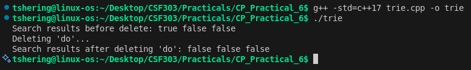
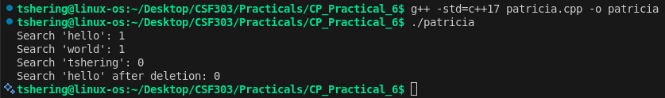
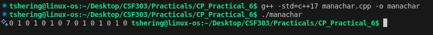

# CP Practical 6 — String Algorithms

## Overview
This directory contains 3 CPP implementations for Practical 6. Include source files, screenshots and a short reflection.

## Files
- **trie.cpp:** Trie (Prefix Tree) data structure for efficient string storage, search, and deletion.
- **patricia.cpp:** PATRICIA Trie (Practical Algorithm to Retrieve Information Coded in Alphanumeric) for compressed trie implementation.  
- **manachar.cpp:** Manacher's Algorithm for finding longest palindromic substrings in O(n) time.  

## Build and Run
Basic compile and run steps for each file:
- g++ -std=c++17 manachar.cpp -o manachar && ./manachar
- g++ -std=c++17 trie.cpp -o trie && ./trie
- g++ -std=c++17 patricia.cpp -o patricia && ./patricia

## Screenshots
- Screenshot for trie.cpp  
    

- Screenshot for patricia.cpp  
    

- Screenshot for manachar.cpp  
    

## Reflection

This practical implements three fundamental string and trie-based algorithms:

1. **Manacher's Algorithm:**  An O(n) linear time algorithm for finding the longest palindromic substring in any string. It uses the mirror property of palindromes and maintains a center and right boundary to avoid redundant comparisons.

2. **Trie (Prefix Tree):** A tree data structure that stores strings efficiently with O(m) insertion, search, and deletion where m is the string length. Includes support for dynamic deletion while maintaining tree integrity.

3. **PATRICIA Trie:** A space optimized variant of the standard trie that compresses paths with single children, reducing memory usage while maintaining efficient string operations.

### Key Challenges and Solutions

- **Manacher's Algorithm:** Understanding the mirror property and boundary expansion was initially complex. The solution involved carefully tracking the center and right boundary to leverage previously computed palindrome radius, reducing redundant character comparisons.

- **Trie Deletion:** Implementing safe deletion that properly handles leaf nodes and internal nodes required recursive backtracking. The challenge was ensuring nodes are only deleted when they have no remaining children and are not word endings.

- **PATRICIA Trie Complexity:** The main challenge was implementing the string prefix compression logic and binary tree navigation. Using `shared_ptr` for memory management simplified dynamic node creation and deletion.

### What You Learned

- **String Algorithms:** Gained deep insight into advanced string processing techniques that operate in linear time, particularly how Manacher's algorithm exploits palindrome properties for efficiency.

- **Trie Variants:** Understood the tradeoffs between standard tries (simpler, more memory) and PATRICIA tries (compressed, more complex logic).

- **Memory Management:** Experienced practical application of smart pointers and dynamic memory allocation in C++ for tree-based data structures.

- **Time Complexity Analysis:** Recognized how algorithm design choices (e.g., using mirror properties) dramatically improve performance from O(n²) naive approach to O(n).

